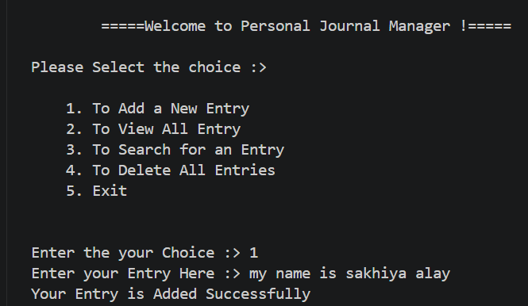
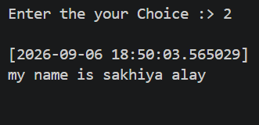
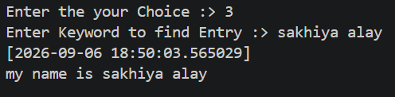
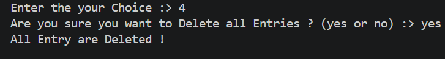

# Personal Journal Manager

[](https://www.python.org/)
[](#license)
[](#requirements)

A simple command-line journal app in Python. Add, view, search, and delete journal entries — all saved to a local text file with automatic timestamps.

## Features

- Add a new entry (timestamped automatically)
- View all entries
- Search entries by keyword
- Delete all entries (with confirmation)

## Requirements

- Python 3.x
- No external libraries needed (uses built-in `datetime` module)

## Setup

1. Open `File_operator.py` and update the file path to match your system:
   ```python
   "D:\\Python\\Project\\File_project\\Journal.txt"
   ```
2. Run the script:
   ```bash
   python File_operator.py
   ```

## Usage

You'll see a menu with 5 options:

```
1. To Add a New Entry
2. To View All Entry
3. To Search for an Entry
4. To Delete All Entries
5. Exit
```

Enter a number to choose an action.

### Add a new entry


### View all entries


### Search for an entry


### Delete all entries


## How it works

- `entry()` — saves your input with a timestamp
- `view()` — reads and prints all entries
- `search()` — finds entries containing a keyword
- `delete_Entry()` — clears the journal file after confirmation

Errors (invalid choice, missing file, no entries) are handled so the program doesn't crash.

## Possible improvements

- Make the file path configurable instead of hardcoded
- Allow deleting a single entry
- Handle non-numeric menu input
- Export entries to CSV or PDF

## License

Free to use and modify for personal or educational purposes.
