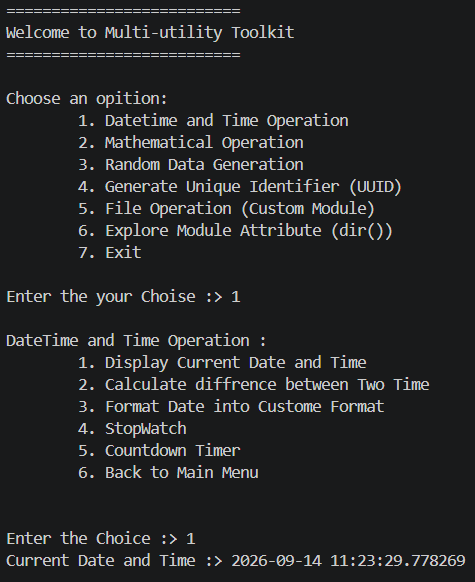
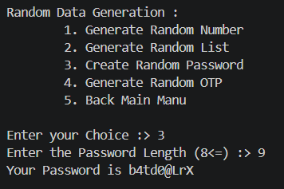
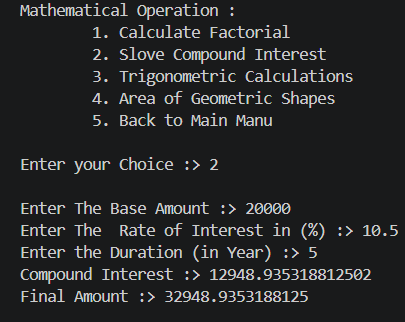

# ⚡ Multi-Utility Toolkit

> **A lightweight Python CLI toolkit that brings everyday developer utilities together in one place — simple, modular, and dependency-free.**

---

## 🚀 What is Multi-Utility Toolkit?

**Multi-Utility Toolkit** is a modular Python command-line application designed to combine multiple useful utilities into a single interactive toolkit.

Instead of creating separate programs for common tasks, the project provides a central menu for:

* 🕒 Date & time operations
* 🧮 Mathematical calculations
* 🎲 Random data generation
* 🆔 UUID generation
* 📁 File operations
* 🔍 Python module exploration

Built with **Python's standard library**, the toolkit requires **no external packages**.

---

## ✨ Features

| Module                 | Capabilities                                                         |
| ---------------------- | -------------------------------------------------------------------- |
| 🕒 **Datetime & Time** | Current datetime, date difference, formatting, stopwatch & countdown |
| 🧮 **Mathematics**     | Factorial, compound interest, trigonometry & geometric areas         |
| 🎲 **Random Data**     | Random numbers, passwords & OTP generation                           |
| 🆔 **UUID Generator**  | Generate unique identifiers using Python's `uuid` module             |
| 📁 **File Operations** | Perform file-related operations through a custom module              |
| 🔍 **Module Explorer** | Inspect available attributes using Python's `dir()`                  |

---

## 🛠️ Tech Stack

<strong>Python</strong> · <strong>Git</strong> · <strong>GitHub</strong> · <strong>VS Code</strong>

### 📚 Python Standard Library

`datetime` · `time` · `random` · `uuid`

### 🧠 Concepts

`Functions` · `Classes` · `Modules` · `Packages` · `OOP` · `Exception Handling` · `Reflection`

---

## 📸 Screenshots

  
  

  

---

## 💡 Why This Project?

This project demonstrates how multiple Python concepts can be combined into a practical CLI application.

It focuses on:

> **Modularity • Reusability • Python Standard Library • Clean CLI Interaction**

The project also provides hands-on practice with custom modules, packages, static methods, exception handling, random data generation, UUIDs, file handling, and Python introspection.

---

## 🏆 Highlights

* ⚡ Lightweight and fast
* 🧩 Modular architecture
* 📦 Zero external dependencies
* 🐍 Built entirely with Python
* 🔍 Includes Python `dir()` reflection
* 🎯 Multiple utilities in one application
* 💻 Interactive command-line interface

---

### ⚡ Built with Python · Designed for Developers

**Multi-Utility Toolkit**

