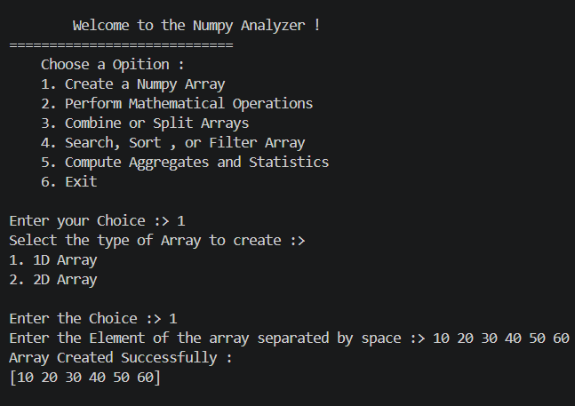
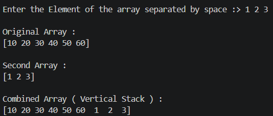
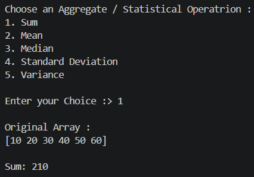

# 🔢 NumPy Analyzer

A menu-driven, command-line Python application for creating and analyzing NumPy arrays. Build 1D or 2D arrays interactively, then index, slice, do math, combine, split, search, sort, filter, and compute statistics, all from the terminal.

---

## ✨ Features

| Menu Option | What it does |
|---|---|
| **1. Create a NumPy Array** | Create a 1D array, or a 2D array by giving rows and columns. Afterwards you can run **Indexing** or **Slicing** on it. |
| **2. Mathematical Operations** | Addition, subtraction, multiplication and division of the current array with a second array you enter. |
| **3. Combine or Split Arrays** | Combine the current array with a new one, or split it into equal parts. |
| **4. Search, Sort, or Filter** | Find the index of a value, sort the array, or filter values that are greater than / less than a number. |
| **5. Aggregates and Statistics** | Sum, Mean, Median, Standard Deviation and Variance. |
| **6. Exit** | Quit the program. |

Both **1D** and **2D** arrays are supported in most operations.

---

## 📸 Screenshots

### Main Menu & Array Creation


### Combining Arrays


### Aggregate / Statistical Operations


---

## 🛠️ Requirements

- Python 3.8 or higher
- NumPy **2.0 or higher** (the combine feature uses `np.concat`, which was added in NumPy 2.0)

```bash
pip install "numpy>=2.0"
```

---

## 🚀 Getting Started

1. Clone or download this project.
2. Install the dependency:
   ```bash
   pip install "numpy>=2.0"
   ```
3. Run the program:
   ```bash
   python numpay_analyzer.py
   ```

---

## 📖 Usage Example

```text
Welcome to the Numpy Analyzer !
============================
    Choose a Opition :
    1. Create a Numpy Array
    2. Perform Mathematical Operations
    3. Combine or Split Arrays
    4. Search, Sort , or Filter Array
    5. Compute Aggregates and Statistics
    6. Exit

Enter your Choice :> 1
Select the type of Array to create :>
1. 1D Array
2. 2D Array

Enter the Choice :> 1
Enter the Element of the array separated by space :> 10 20 30 40 50 60
Array Created Successfully :
[10 20 30 40 50 60]
```

**Tip:** Always create an array first (option 1). Every other option works on the most recently created array.

---

## 🧱 Project Structure

```text
.
├── numpay_analyzer.py    # Main program
├── README.md
└── screenshots/
    ├── main_menu.png
    ├── combine_arrays.png
    └── aggregate.png
```

### Code Overview

- `Array`: handles array creation, indexing, slicing, and the indexing/slicing sub-menu.
- `DataAnalytics(Array)`: inherits from `Array` and adds math operations, combine/split, search/sort/filter, and aggregates.
- `ValidELement`: custom exception for invalid input.

---

## ⚠️ Notes & Known Limitations

- Only **integer** values are accepted as array elements.
- For 2D math and combine operations, the second array must have the same shape (rows × columns) as the original.
- Splitting requires the array to divide into equal parts.
- Invalid input shows an "Enter Valid Value !" message and returns to the main menu.

---

## 🔮 Future Improvements

- Support float values
- Matrix multiplication and transpose
- Save/load arrays from files
- Input validation without leaving the current menu

---

## 📄 License

This project is open source and free to use for learning purposes.